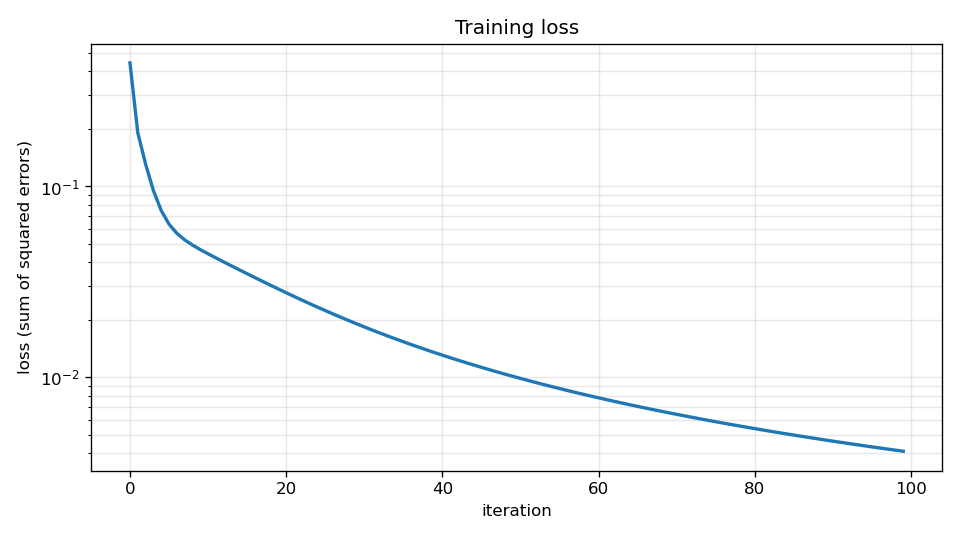
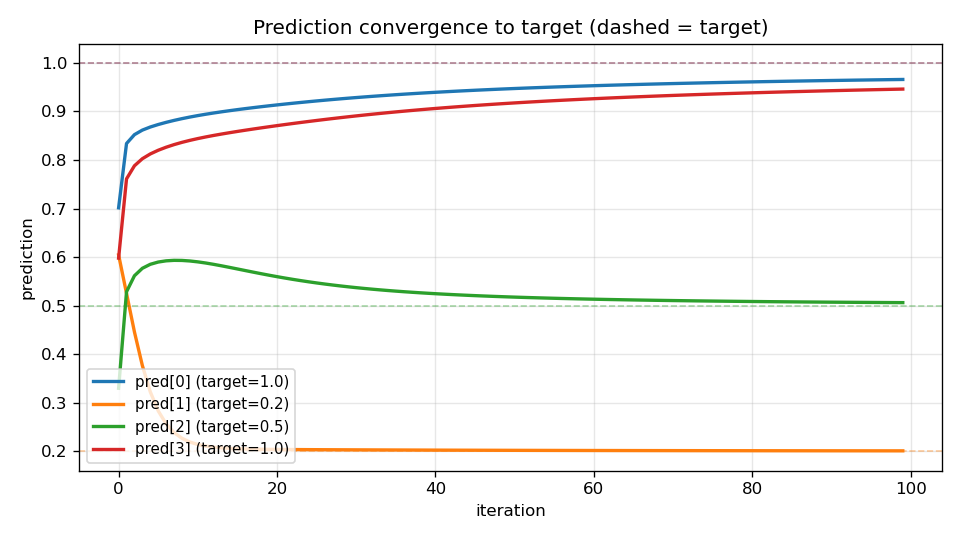

# micrograd

A C++23 port of Andrej Karpathy's [micrograd](https://github.com/karpathy/micrograd) — a tiny reverse-mode autograd engine over scalar values, plus a minimal MLP built on top of it.

## Build

```sh
cmake -S . -B build      # only if build/ is missing or CMakeLists.txt changed
cmake --build build
```

Compiles with `-Wall -Wextra -g -O0 -Wimplicit-fallthrough` under C++23.

## Run

Two example executables are produced under `build/`:

- `./build/microgradtest` — single-neuron forward + backward pass; streams the resulting graph (each node's `data`, `grad`, `op`, `opstring`) to stdout.
- `./build/mlptest` — trains a 3-input MLP with hidden layers `[4, 4, 1]` on four samples using vanilla gradient descent and prints predictions + loss per iteration.

## Training run

Running `./build/mlptest` trains for 100 iterations at LR=0.05 on:

| input         | target |
|---------------|-------:|
| `[ 2,  3, -1]`|   1.0  |
| `[ 3, -1, .5]`|   0.2  |
| `[.5,  1,  1]`|   0.5  |
| `[ 1,  1, -1]`|   1.0  |

Loss drops by roughly two orders of magnitude and predictions settle near their targets:





Final predictions ≈ `[0.97, 0.20, 0.51, 0.95]` vs targets `[1.0, 0.2, 0.5, 1.0]`.

To regenerate the plots:

```sh
python3 scripts/plot_training.py
```

(requires `matplotlib`; output goes to `docs/`.)

## Design

The split that makes the engine work:

- **`Value`** is a thin value-typed handle holding a `std::shared_ptr<Node>`. Copying a `Value` shares the underlying node — it does *not* clone the graph.
- **`Value::Node`** is the shared graph node: `data`, `grad`, parent nodes in `prev`, an `Op` tag (`LEAF`, `ADD`, `MUL`, `TANH`, `POW`), and `label`/`opstring` for debugging.

Operator overloads (`+`, `*`, `-`, `tanh()`, `pow()`) construct a new `Node` whose `prev` points to the operand nodes, and return a `Value` wrapping it. The DAG stays alive as long as any `Value` references it.

### Backward pass

`Value::backward()` delegates to `Node::backward()`, which is the topo-driver:

1. DFS from the output node to build a post-order topological sort onto a `std::stack<Node*>`.
2. Pop the stack and call `Node::backward_local()` on each node. `backward_local` dispatches on the `Op` tag and *adds* the local-gradient × this-node's-grad into each parent's `grad` — it does not recurse.

Splitting the topo-driver from the per-op gradient rule is what guarantees a node's `grad` is fully accumulated by all downstream consumers before it propagates upward. Without that split, diamond DAGs (a non-leaf `Value` reused by multiple downstream ops) would produce wrong gradients.

The caller seeds `grad = 1.0` on the output node before calling `backward()`. The current topo-sort is intentionally simplified for graphs with a single output root (e.g. an MLP with one output neuron).

### MLP

`Neuron` → `Layer` → `MLP` are tiny wrappers over the autograd engine. Each `Neuron` holds its weights and bias as `Value`s; `Neuron::operator()` builds the forward-pass subgraph by composing the operator overloads. `MLP::parameters()` flattens all weights and biases into a single vector for the training loop.

A training step looks like:

```cpp
Value loss = 0.0;
for (auto&& [pi, yi] : std::views::zip(preds, ys))
    loss = loss + (pi - yi).pow(2.0);

loss.grad(1.0);
loss.backward();
for (auto& p : mlp.parameters()) {
    p.data(p.data() - LEARNING_RATE * p.grad());
    p.grad(0.0);
}
```

Parameters are mutated *in place* through the shared `Node`: `Value::data(double)` writes to `node_->data`, and every handle pointing at that node sees the update.

## Layout

```
include/   value.hpp, neuron.hpp, layer.hpp, mlp.hpp   - public headers
src/       value.cpp, neuron.cpp, layer.cpp, mlp.cpp   - compiled into libmicrograd.a
examples/  microgradtest.cpp, mlptest.cpp              - the two executables
scripts/   plot_training.py                            - regenerates the README figures
docs/      loss.png, convergence.png                   - figures embedded above
```
